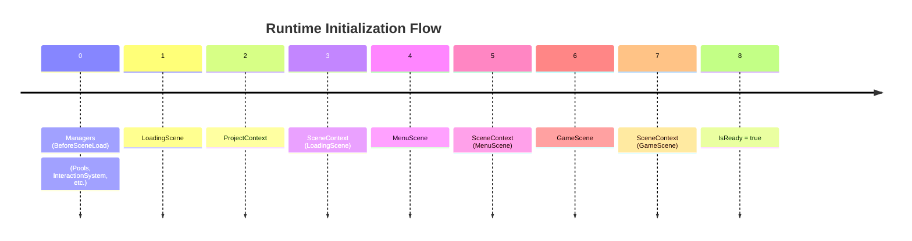
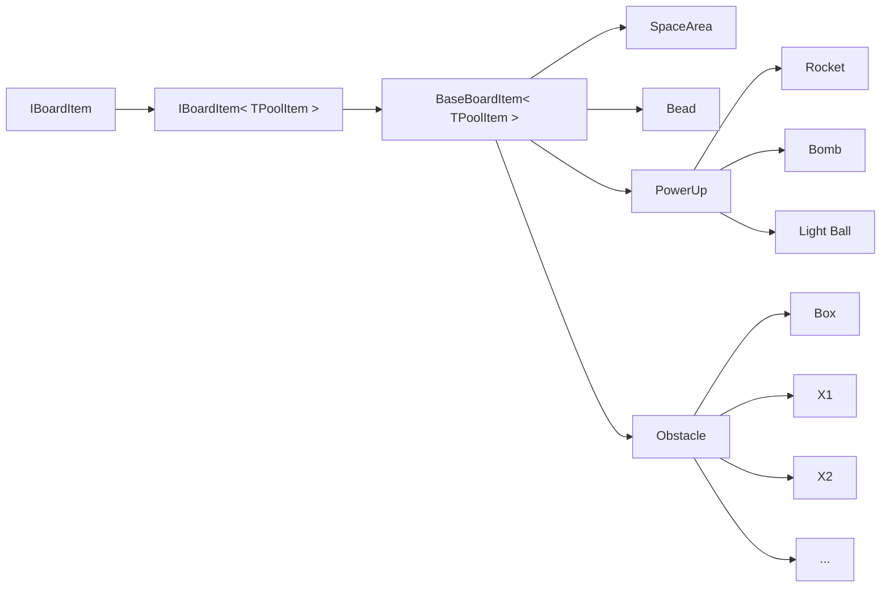

# Blast Bender

<p align="center">
  
</p>

<p align="center">
  
    <!---->
</p>

<p align="center">
  <strong>These images were generated by an AI model.</strong>
</p>

## Introduction
Welcome! This repository is a clone inspired by popular blast games. This project aims to implement clean coding principles and use various design patterns to create dynamic game mechanics using C# and Unity.

<p align="center">
  
</p>

## Dependencies
This project integrates numerous external libraries. Zenject, a robust framework, has been utilized for managing dependencies.This framework enhances the modularity and sustainability of the code, making significant contributions to the project's architecture. UniTask has been used for asynchronous operations, while Toolbar Extender have been employed to enhance the Unity editor.
- [Zenject](https://github.com/modesttree/Zenject)
- [UniTask](https://github.com/Cysharp/UniTask)
- [Toolbar Extender](https://github.com/marijnz/unity-toolbar-extender)

## Game Structure Overview

Successful games need more than good code and design; they also require well-thought-out levels. This project has two main parts:

- Main Game: Where players can play.
- Level Generator: Where new levels are created.


Scenes in the game are created only once and persist throughout the game. They are not created or deleted during gameplay. Each scene performs its specific function. Scenes do not open or close themselves; instead, objects are either pooled or toggled on and off.

When the game starts, the scenes load in the following order:

- For the Main Game: Loading Scene -> Menu Scene -> Game Scene
- For the Level Generator: Loading Scene -> Menu Scene -> Game Scene -> Level Generator Scene

If you do not want the current scene to be active when you run the game, and prefer starting from the Loading Scene, you should select 

- BlastBender(in the menu bar) -> LoadSceneOnPlay -> Loading Scene

This feature allows you to debug quickly without having to open the "Loading Scene" every time.

<span style="color:ivory;">When you run the game, managers are created in a way that they cannot be destroyed. This initialization occurs before the scene loads.</span>

```csharp
[RuntimeInitializeOnLoadMethod(RuntimeInitializeLoadType.BeforeSceneLoad)]
```

<span style="color:ivory;">With the first scene, the ProjectContext is created, followed by the scenes and their respective SceneContexts. Each CONTEXT creates the desired controllers, and injections take place.
The management of dependencies is handled by the Installers within the Contexts.</span>




#### Board Data Structure



<br />

The diagram here displays the class hierarchy. Each class is a Controller and manages its associated Item. The TPoolItem item serves as the View of the Item and is its physical form.

 I can store an IBoardData array for each level.To make an Item meaningful, I need to know its Row, Column, and the type of the Item.IBoardData contains all of these.As you can see, it is simple.

 The aim here is to implement a structure for items that aligns with the MVC system. This way, when we add a new item (e.g., Rocket Power Up or Box Obstacle), it will be able to manage its own system.

When writing these systems, it was important to pay attention to the open-close principles. For example, a Space is an item. The Space does not move or appear. On the other hand, a Bead is an item that appears on the scene and moves. In this case, our Bead controller should implement the IMoveable and IVisual interfaces.

```csharp
namespace BoardItems.LevelData
{
    [CreateAssetMenu(fileName = "Levels", menuName = "Level")]
    public class LevelData : ScriptableObject
    {
        public int RowLength;
        public int ColumnLength;

        [SerializeReference] 
        public IBoardItem[] BoardItems;

        public Border.Border[] Border;
    }
}
```

Now let’s examine how Unity stores this data in YAML format.

```yaml
- rid: 7831880784201908428
      type: {class: Bead, ns: BoardItems.Bead, asm: Assembly-CSharp}
      data:
        _row: 0
        _column: 4
        _color: 1

- rid: 7831880784201908429
      type: {class: SpaceArea, ns: BoardItems.Void, asm: Assembly-CSharp}
      data:
        _row: 0
        _column: 5
```

Holding a reference with [SerializeReference] makes our work easier. There is color in Bead, but it is not necessary for SpaceArea.

I will continue 😊

